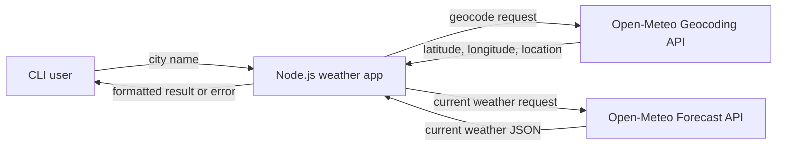

# High-Level Design (HLD)

## 1. Overview

`weather-app` is a command-line application that retrieves and displays current weather for a city. It uses the Open-Meteo public APIs and runs on Node.js without third-party runtime dependencies.

## 2. Goals

- Accept a city name from the command line.
- Resolve the city to coordinates.
- Retrieve current weather for those coordinates.
- Present temperature, humidity, condition, and wind speed in a readable format.
- Fail clearly when input, network access, or API data is invalid.

## 3. Scope

### In scope

- One city per execution.
- English geocoding results.
- Current weather only.
- Metric units: degrees Celsius and kilometers per hour.
- Terminal output and process exit status.

### Out of scope

- User accounts, persistence, or a database.
- Web or mobile UI.
- Forecasts, historical data, alerts, or severe-weather notifications.
- API-key management; the current Open-Meteo endpoints are called without a key.

## 4. System Context



## 5. Logical Architecture

The application has four logical responsibilities in one source file:

1. **CLI input**: reads `process.argv[2]` and prints usage when absent.
2. **HTTP/JSON transport**: `makeRequest(url)` performs HTTPS GET requests and parses JSON.
3. **Weather orchestration**: `getWeather(cityName)` performs geocoding followed by weather retrieval.
4. **Presentation**: maps WMO weather codes and prints the current conditions.

## 6. Main Flow

1. Start with `node app.js <city-name>` or `npm start -- <city-name>`.
2. Encode the city and call the Open-Meteo geocoding endpoint.
3. Select the first returned result.
4. Call the forecast endpoint with the selected latitude and longitude.
5. Translate `weather_code` to a human-readable condition.
6. Print the location and current measurements.
7. Exit with code `0` on success or code `1` on handled failure.

## 7. External Dependencies

- Node.js with ECMAScript module support.
- Node.js built-in `https` module.
- `https://geocoding-api.open-meteo.com/v1/search`.
- `https://api.open-meteo.com/v1/forecast`.

## 8. Reliability and Security Considerations

- City input is URL-encoded before it is inserted into the geocoding URL.
- API responses are parsed as JSON; malformed responses become errors.
- Network and application failures are reported to stderr and terminate the process.
- The app currently has no request timeout, retry policy, response-status validation, or schema validation. These are production-hardening opportunities.

## 9. Deployment

The application is deployed wherever Node.js is available. Installation is currently unnecessary because `package.json` declares no runtime dependencies. A typical execution is:

```text
npm start -- London
```
